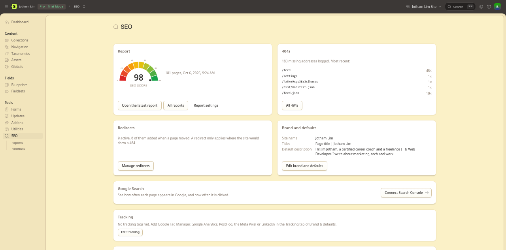
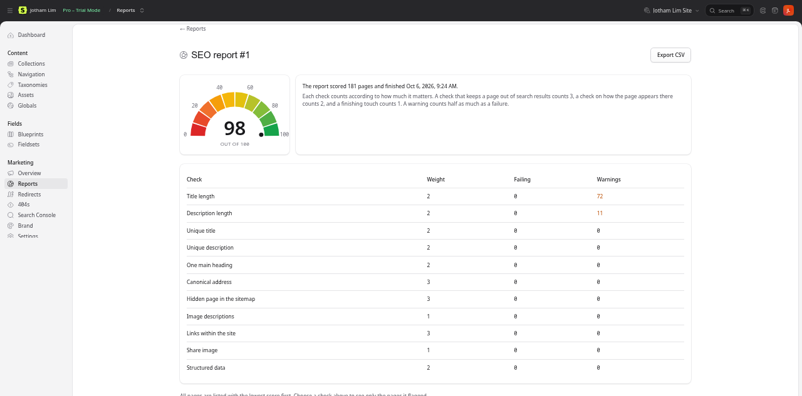
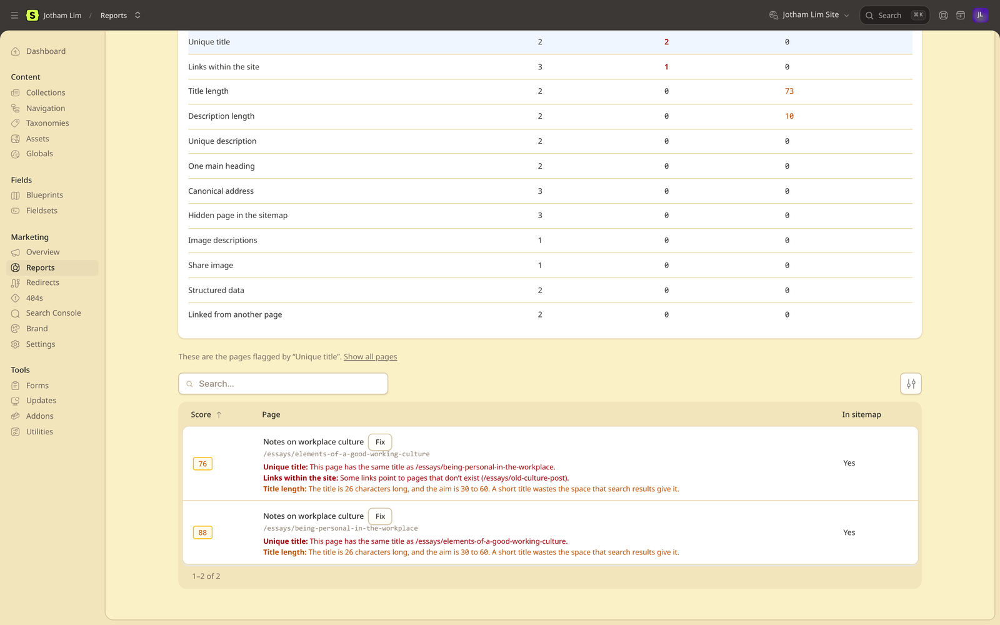
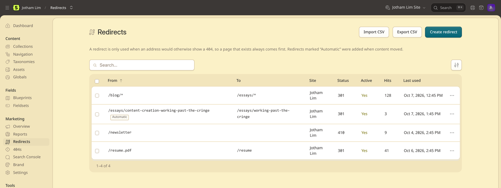
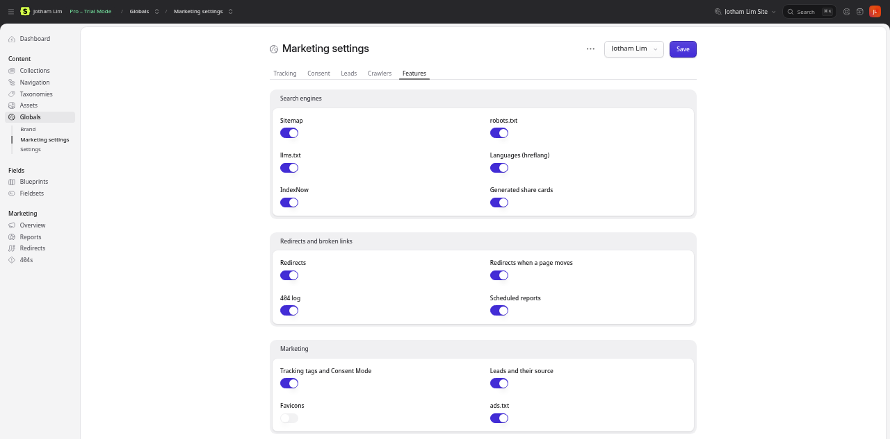
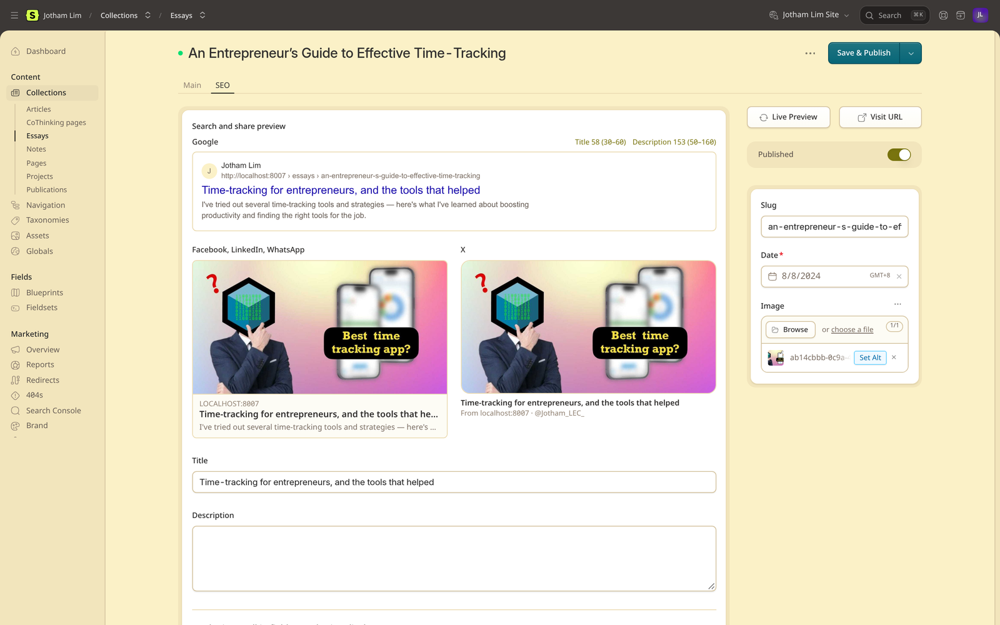
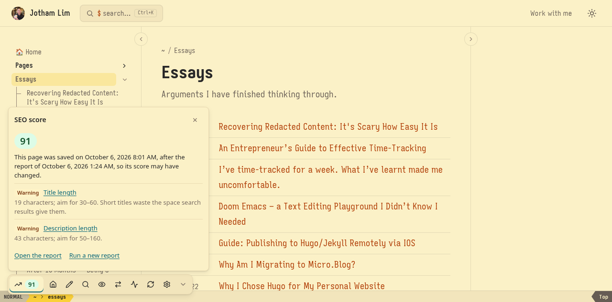

# A guide for editors

This guide is for the people who write and look after the site's pages. It explains what the Marketing section of the control panel and the SEO fields on each page do and how to use them. No coding involved.

**SEO** (search engine optimisation) is about how your pages show up in Google and other search engines, and how they look when someone shares a link on Facebook, LinkedIn, WhatsApp or X. Most of it happens on its own: if you leave the SEO fields empty, the site fills in sensible values from your page's title, description and text.

## The Marketing section

Everything the addon adds to the control panel is in its own **Marketing** section of the sidebar, between Fields and Tools. Its items are **Overview**, **Reports**, **Redirects**, **404s**, **Search Console**, **Brand** and **Settings**. The fields carry no descriptions in the control panel, so this page is where each one is explained. You see only the items your role allows: someone who may not manage redirects has no Redirects item, for example.

With more than one site, the overview, the 404s, the reports, Brand, Settings and the dashboard card are of the site chosen in the control panel's site menu. Redirects list every site's, with a Site column.

## Overview

**Marketing → Overview** shows the latest report's score, recent 404s, redirects and the brand, and, once Search Console is connected, Google Search's clicks and appearances with the pages people click most. Each part has a button to the screen that changes it. It also lists the files the site serves (the sitemap, robots.txt, llms.txt, the web app manifest and the home page's share card), and marks any file in the `public` folder that is served instead of the addon's.

## Reports

**Marketing → Reports** checks every page of the site the way a search engine sees it, and gives each page a score out of 100. The site's score is the average.

Click **Run report**. A bar shows the progress, and a few hundred pages take under a minute. When it's done you see:

- **The site's score**.
- **The checks**, with how many pages fail each one or get a warning. Choose a check to see only the pages it flagged.
- **The pages**, lowest score first. Each one lists its problems and has a **Fix** link to its edit screen.

**Export CSV**, on a report, downloads its pages as a spreadsheet, one row per page with the worst score first. The columns are Address, Title, Score, Failed checks and Warnings, so you can share the list or work through it outside the control panel.

What the checks look for:

| Check | Counts | What to do |
|---|---|---|
| Links within the site | 3 | A link to a page that doesn't exist: fix the link, or add a redirect. A link that goes through a redirect: link straight to the new address. |
| Canonical address | 3 | Usually fine on its own; tell your developer if it fails. |
| Hidden page in the sitemap | 3 | A page set to hide from search engines but still in the sitemap: tell your developer. |
| Title length | 2 | Write an SEO title that fits. |
| Unique title | 2 | Two pages with the same title: make each one say what that page is about. |
| Description length | 2 | Write a description of the right length. |
| Unique description | 2 | The same, for descriptions. |
| One main heading | 2 | Each page should have one main heading. Usually the page template's job. |
| Structured data | 2 | Usually the developer's job. |
| Image descriptions | 1 | Describe each image in its "alt text" (in the asset's settings), for people who can't see it and for search engines. |
| Share image | 1 | Pages without a picture when shared. |
| Linked from another page | 2 | A page in the sitemap that no other page links to (a warning): link to it from a related page, so search engines and readers find it. The home page is exempt. |
| Links to other sites | 1 | Off unless your administrator turns it on, since it asks each linked site: links to pages that no longer exist (404, 410), even after a redirect, or to sites that are gone. Links to `localhost` or a private network aren't checked. |

A **warning** counts half. Pages set to hide from search engines are listed but not scored.

### The Settings tab

The Reports screen has two tabs, **Reports** and **Settings**. The Settings tab is shown to people who may change the addon's settings, and holds what the reports check and how they run:

- **Checks**: a switch for each check (a check that's off is left out of the reports and the scores), and the shortest and longest a title and a description should be. The same lengths colour the counters in each page's preview.
- **Running**: collections to leave out, the most pages a report covers, how many pages each step checks, how many reports to keep, and whether reports also run on their own, daily or weekly.

## Redirects

**Marketing → Redirects** lists every redirect. Those marked **Automatic** were added when a page moved (see [When a page's address changes](#when-a-pages-address-changes)).

- **Create redirect**: send one address somewhere else.
  - **From**: an address on this site, starting with `/`, for example `/old-page`. A `*` matches anything: `/blog/*` covers every address under `/blog/`. An address copied from the browser (`/caf%C3%A9`) works too. Capitals count: `/About` and `/about` are two addresses, unless your developer has set redirects to ignore them.
  - **To**: where to send visitors: `/new-page`, or a full address on another site. With a `*` in From, `$1` stands for whatever it matched: from `/blog/*` to `/articles/$1` sends `/blog/my-post` to `/articles/my-post`. A `#section` at the end is kept. A redirect that would send visitors back where they came from, straight away or through another redirect, isn't accepted.
  - **Type**: *301 Moved for good* (the usual one), *302 Moved for now* (temporary, e.g. during a sale), or *410 Gone* (removed for good; leave To empty).
  - **Active**: switch off to pause a redirect without deleting it.
  - **Campaign link**: for a short address you share in a campaign or print on a flyer, like `/go/linkedin`. Fill in the UTM tags (source, medium, campaign; content and term if you use them) and they're added to where it goes, so Google Analytics and each lead's source show the campaign. Choose *302*, so browsers don't remember it and every click is counted in the list.
  - **Site** (only with more than one site): the site whose address this is. Leave empty for every site. A site's own redirect wins over one for every site from the same address. Redirects for every site are listed, added and changed only by someone who may work on every site, as they apply on all of them. On a site in a folder, such as French under `/fr/`, From and To leave the folder out, as the page's own address does: `/a-propos` is `example.com/fr/a-propos`. Redirects written with the folder (`/fr/a-propos`) keep working.
- **Hits** and **Last used** show whether a redirect is still needed.
- **Import CSV** and **Export CSV**: move many redirects at once, for example from an old site. The file has the columns `source,target,status,active`, and `site` with more than one site (a site's handle, or empty for every site).

A redirect only applies when its address doesn't exist as a page. If you bring a page back at an old address, the page shows, not the redirect.

## 404s

A **404** is what visitors get when they ask for an address that doesn't exist. **Marketing → 404s** lists the ones real visitors hit, most recent first, with how often and the last page that linked there. Bots and hacking attempts are left out.

Use it to catch broken links. For a missing address that should lead somewhere, open the row's **⋯** menu and choose **Create redirect**: the form opens with the address (and, with more than one site, its site) filled in, and you only add where it should go.

## Search Console

**Marketing → Search Console** connects Google Search Console, so the overview can show how often each page appears in Google and how often it is clicked. Connecting it is a one-time task for whoever looks after the site's settings, and the screen lists the steps, with links to the right pages at Google. You create a key in Google Cloud and upload it, add the key's email as a user in Search Console, confirm the property (the site's address, filled in for you), then check the connection and import. If the check fails, it says what to fix. With several sites, do the property, the check and the import once per site, with that site chosen in the control panel's site menu; the key is uploaded once.

## Brand

**Marketing → Brand** (the Brand global set) holds what describes the site and its owner. Fill it in once and come back when something changes. With several sites, each site has its own values, and a site that leaves a field empty takes the default site's.

**Brand tab**
- **Add the site name to page titles**: off by default, so a page's title is just its own ("Pricing"), as most top Google results are. On, it becomes "Pricing · Your site" when that fits in 60 characters.
- **Title separator**: shown when the site name is added; what goes between the two, with a space added on each side. Leave empty for "·".
- **Default description**: used for pages that have no description and no text to borrow one from.
- **Default share image**: shown when a page is shared and has no picture of its own. 1200 × 630 pixels works best.
- **Other site name**: a shorter name or acronym search engines may show instead of the site name.
- **X handle**: your account on X (Twitter), without the @.
- **Icon**: the site's icon in browser tabs, bookmarks and phone home screens. Upload one square image, 512 × 512 pixels or more (PNG, or SVG to stay sharp); every size is made from it. **Theme colour** tints the browser's bar on phones; **Icon background** sits behind the icon on an iPhone home screen (white unless set).

**Publisher tab.** Who is behind the site, so search engines can show it correctly. Pick the most specific **type** (a Store rather than a Local business; an Educational organization), or two (Educational organization and Local business), or type any other schema.org type. Then the name, another name, when it was founded, a description, logo or portrait, phone, email, area served, profiles elsewhere and contact points. **Address**: needed for a business people visit; leave it empty for one that only delivers or serves an area. **Local business**: price range, map coordinates and opening hours. Each value only goes out where the type accepts it, so filling in more than applies does no harm.

**Shop tab** (for a site that sells; your developer adds it). The **currency** of your prices; your **return policy** (within so many days, any time, or not accepted, for a country, and/or a link to the policy page); and your **shipping rates**: one row per destination and order value (for example free over RM 300), with the delivery time in days. Search engines show these with your products.

**Share cards tab.** The background, text and accent colours of the generated share pictures, and a logo or portrait to put on every card.

## Settings

**Marketing → Settings** (the Marketing settings global set) holds the tracking tags, consent, leads and what crawlers are told. Like Brand, each site has its own values.

**Tracking tab.** Paste the ID of each tool you use: **Google Tag Manager**, **Google Analytics 4**, **PostHog** (and its host, for an EU project), the **Meta Pixel** and the **LinkedIn Insight Tag**. Leave the others empty. They load on the live site only, never while you edit. With Google Tag Manager, add every other tool as a tag inside GTM rather than here: a tool loaded both ways counts each visit twice, so the tab and the overview warn you when that happens. An ID your developer set in `.env` wins over the one here.

**Consent tab**, for a cookie banner you already have: what Google's tags may do before a visitor answers it. Turn on Consent Mode, choose what's denied until the visitor agrees (everything, by default), and how long to wait for the banner. **Only in these regions**: the defaults apply there (for example the EEA, the UK and Switzerland), and everything is granted elsewhere. See [tracking.md](tracking.md#consent-mode) for how the banner passes on the answer.

**Leads tab.** **Send form submissions as leads** sends every form sent on the site to your tools as a lead (and to a LinkedIn conversion, if you paste its ID); **Save where each lead came from** adds the campaign, the site that sent them and their first page to each submission, under **Forms**. See [tracking.md](tracking.md#leads).

**Crawlers tab**
- **Verification** codes from Google Search Console, Bing, Yandex or Pinterest, when they ask you to prove you own the site.
- **robots.txt Disallow**: parts of the site search engines shouldn't visit. Leave empty unless you're told otherwise.
- **Allow AI training**: off turns away the crawlers that gather pages to train AI models (OpenAI's GPTBot, Anthropic's ClaudeBot, Google-Extended for Gemini, Applebot-Extended, and Common Crawl's CCBot, whose open dataset AI developers train on). Google Search is unaffected.
- **Allow AI search**: off turns away the crawlers behind ChatGPT search, Claude and Perplexity answers, so the site isn't quoted there. Fetchers a person sends from those apps don't all read robots.txt.
- **robots.txt extra lines**: extra rules, for example for AI crawlers.
- **ads.txt**: only for a site that sells ad space (AdSense and others): paste the lines your ad network gives you; they're served at `/ads.txt`.

The site also serves **/llms.txt**, a list of its pages with their descriptions for AI assistants, made from the same pages as the sitemap.

## Features

The **Features** tab of **Marketing → Settings** switches off what the site doesn't use (the 404 log, IndexNow, tracking and so on). It applies to the whole install, so it appears on the default site only, and only for people who may change the addon's settings. A feature that `config/marketing-toolkit.php` switches off is shown off and can't be switched on there. A feature that's off isn't loaded at all; switch it back on and everything it saved is still there.

## A page's SEO tab

Every page with SEO fields has them on its SEO tab.

### The search and share preview

At the top is a live preview:

- **Google**: how the page appears in search results, with its title, address and description.
- **Facebook, LinkedIn, WhatsApp** and **X**: how the link looks when shared.

It updates as you type, before you save. Values you leave empty show the defaults the site will really use, so what you see is what people get.

Above the Google result are two counters:

- **Title**: Google shows about 60 characters; longer titles get cut off with "…".
- **Description**: aim for 50 to 160 characters.

Green is a good length, amber is too short, red is too long.

If you see *"Hidden from search engines: this result will not appear"*, the page is set not to show in search results. That's expected on a test copy of the site; on the live site, check the "Hide from search engines" switch below.

### The fields

All the fields are optional, and an empty field means "use the default". **Title** and **Description** come first. Below them, the fields are in two groups: **Sharing**, for how the page looks when it's shared, and **Advanced**, for settings most pages never need.

| Field | What it does | When it's empty |
|---|---|---|
| **Title** | Replaces the whole title in Google and the browser tab, exactly as you type it. | The page title, followed by the site name when there's room. |
| **Description** | The text under the title in Google, and on share cards. | The page's own description, or its first paragraph. |

**Sharing**

| Field | What it does | When it's empty |
|---|---|---|
| **Share image** | The picture when the page is shared. Cropped to 1200 × 630. | A share card is drawn for the page automatically (see below). |
| **Card title** / **Card subtitle** | The words on the generated share card. | The title and the description. |

**Advanced**

| Field | What it does | When it's empty |
|---|---|---|
| **Canonical URL** | Only for a piece first published on another site: the original's address, so search engines credit it. | This page's own address. |
| **Hide from search engines** | Keeps the page out of Google. | The page can be found. |
| **Do not follow links** | Tells search engines not to follow the links on this page. | Links are followed. |
| **In sitemap** | Lists the page in the sitemap search engines read. | On. |
| **No snippet** | Shows no text from this page in Google's results, nor in its AI Overviews and AI Mode. | Text is shown. |
| **Snippet length** | At most this many characters are quoted. It's hidden while **No snippet** is on, since no text is quoted then. | No limit. |
| **Extra JSON-LD** | Structured data for search engines. Leave it to your developer. | Nothing extra. |

### Several languages

On a site in several languages, each translation of a page has its own SEO fields: give each language its own title and description. Search engines are told about the other languages by themselves (with "hreflang" links), so a French visitor is sent to the French page. A translation left as a draft, or hidden from search engines, is left out of those links.

### Share cards

When a page has no share image, the site draws one: the page title and description on your brand colours. You see it in the preview. To change the words, fill in **Card title** and **Card subtitle**. To use a photo instead, upload a **Share image**.

## The front-end toolbar

While you're signed in to the control panel, the live site shows a small button in the bottom-left corner with the page's SEO score. Visitors never see it. Click it, or press **Alt+Shift+M**, to open the toolbar beside it. Its items are icons: point at one, or reach it with Tab, to see its name. With the toolbar open, the score itself opens the **SEO score** panel, and the chevron at the bar's far end (**Minimise**) folds it back to the button.

- **Edit entry** (or **Edit term**) opens the page in the control panel, and **SEO** opens it on its SEO tab.
- **SEO score** (the score badge): the page's score from the latest report and the checks it fails, worst first. Each check links to where you fix it. A page saved since the report says so, and a page the report hasn't seen yet has no score. With Search Console connected, it ends with the page's clicks, impressions and position over the last 28 days.
- **Preview**: the page's Google result and share card, as the SEO tab shows them, and whether it is in the sitemap, hidden from search engines, or pointing at another address.
- **Redirects**: the redirects that send visitors to this page, and one from its address that never applies because the page exists. On a missing page the button turns red and says **Missing page**; the panel says how often the 404 log has seen the address, with **Add a redirect**.
- **Tracking**: which tags load on this page, or why none do, Consent Mode, and what your own browser has agreed to.
- **Sites**: the page on the other sites, with its status, and links to view and edit each one.
- **Refresh this page's cache** (on a site with static caching, for whoever may use the cache utility) and **Control panel** (the house).
- **Toolbar settings** (the gear): see below.

Each panel shows only what your role may see in the control panel. The toolbar takes the colours of your control panel theme, remembers whether you left it open, and closes with Escape. Between pages it stays where it was while the new page's details load. It never shows in Live Preview.

The toolbar's settings are in **Toolbar settings**, and are kept in your browser: its **Corner** (bottom left unless you choose bottom right, top left or top right), its **Shortcut** (**Change**, then press the new keys, or **Turn off**), and **Hide the toolbar**. Minimise keeps the button in its corner; hiding takes the button away too, on every page in this browser, until you press the shortcut, so hiding needs one. Someone who may change the addon's settings can switch the toolbar off for everyone under [Features](#features).

## When a page's address changes

A page's address (its URL) changes when you change its slug, when its date changes on a dated page such as a news article, or when you move it to another place in a page tree. Old links to it, from Google, other sites or your own emails, would then lead nowhere. So the site adds a **redirect**: anyone visiting the old address is sent to the new one.

If you can manage redirects, saving a page whose address changes asks first:

> **This page's address changes.** Saving moves the page from /old-address → /new-address. Add a 301 redirect from the old address, so links to it keep working?

- **Add redirect**: almost always the right answer.
- **Don't add**: only if the old address was never shared (a page you just created and renamed straight away).
- **Don't save yet**: go back to the page without saving.

If you can't manage redirects, the question isn't asked and the redirect is added for you. Moving pages around in a tree adds redirects for the page and everything under it, without asking.

## The dashboard

The **SEO** box on the dashboard (if your administrator added it) shows the latest report's score and the most recent 404s. Click through for the details.
