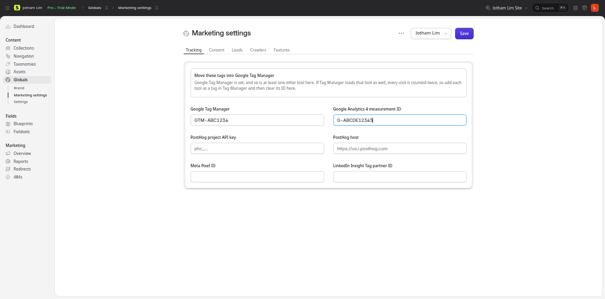

# Tracking and Consent Mode

Marketing Toolkit prints the tags of Google Tag Manager, Google Analytics 4, PostHog, the Meta Pixel and the LinkedIn Insight Tag, with *(Pro)* Google's Consent Mode v2 defaults ahead of them. It has no cookie banner: it works with the one you have (Cookiebot, CookieYes, Iubenda, Complianz, or your own).



## Where the tags go

```blade
<head>
    <meta charset="utf-8">
    <meta name="viewport" content="width=device-width, initial-scale=1">
    <s:seo:head />
    …
</head>
<body>
    <s:seo:body />
```

`<meta charset>` comes first, since browsers look for it in the first 1024 bytes; everything else as high as it can go. `seo:head` prints, in this order:

1. `window.dataLayer` and `gtag()`, and the Consent Mode defaults, when Consent Mode is on.
2. The consent bridge, when Consent Mode is on and PostHog, the Meta Pixel or LinkedIn load directly (see below).
3. Google Tag Manager, Google Analytics 4, PostHog, the Meta Pixel and LinkedIn, for each that has an ID.
4. The meta tags (`<s:seo:meta />`).

`seo:body` prints Google Tag Manager's `<noscript>` iframe, which must be in the body, and the Meta and LinkedIn `<noscript>` pixels when Consent Mode is off. Without JavaScript nobody can answer a banner, so with Consent Mode on those pixels are left out.

Nothing prints outside production (`seo.tracking.environments`) or in Live Preview. With a Content Security Policy that uses Vite's nonce (`Vite::useCspNonce()`), every script gets it.

A site that prints its own meta tags (a Laravel layout that doesn't use `<s:seo:meta />`) takes the tags alone, so the page doesn't get two sets of meta tags. Put any Consent Mode defaults of your own before them:

```blade
<head>
    …
    {!! app(\JothamLec\MarketingToolkit\Tracking\Tracking::class)->head() !!}
</head>
<body>
    <s:seo:body />
```

## One tool, one place: use Google Tag Manager

With Google Tag Manager set, add GA4, PostHog, Meta and LinkedIn **as tags inside GTM** and leave their IDs empty here. A tool loaded by GTM and by this addon counts every visit twice. The Tracking tab shows a warning as soon as both are set, saving the global shows a reminder, and Tools → SEO lists the tools to move.

GTM also handles consent better than any page snippet: each tag has its own consent checks, and Google's tags read Consent Mode by themselves.

## Consent Mode *(Pro)*

The tags are Free; Consent Mode, and the consent bridge below, are Pro. In Free the tags load as soon as the page does, so a site that needs consent first loads them through its banner or through GTM's consent settings.


Turn on **Use Consent Mode** in the Tracking tab and choose, for each of Google's four signals, whether it is denied until the visitor agrees (the default) or granted:

| Signal | Covers |
|---|---|
| `ad_storage` | Advertising cookies. |
| `analytics_storage` | Analytics cookies. |
| `ad_user_data` | Sending visitors' data to Google for advertising. |
| `ad_personalization` | Personalised advertising (remarketing). |

**Wait for the banner** (`wait_for_update`, 500 ms by default) is how long Google's tags hold their first hit for the banner's answer before using the defaults.

**Only in these regions**: country or region codes (`FR`, `DE`, `US-CA`), or **EEA, UK and Switzerland**. The defaults apply to visitors there; everyone else is granted everything. Google works out the visitor's region.

The page then starts with:

```html
<script>window.dataLayer=window.dataLayer||[];function gtag(){dataLayer.push(arguments);}
gtag('consent','default',{"ad_storage":"denied","analytics_storage":"denied","ad_user_data":"denied","ad_personalization":"denied","wait_for_update":500});
</script>
```

## How a banner updates consent

Once the visitor answers, the banner tells Google's tags with a Consent Mode **update**:

```js
gtag('consent', 'update', {
    ad_storage: 'granted',
    analytics_storage: 'granted',
    ad_user_data: 'granted',
    ad_personalization: 'granted',
});
```

and does the same on every later page, from the answer it stored. Most banners do this for you:

- **Cookiebot**: Google Consent Mode is on by default; its script sends the update. Load Cookiebot's script after `<s:seo:head />`, and turn off Cookiebot's own default command (`data-consentmode-defaults="disabled"`), since the addon sends the defaults.
- **CookieYes**: turn on "Support Google Consent Mode (GCM)" in its settings. Leave its default settings off, for the same reason.
- **Iubenda, Complianz, Usercentrics and most others** have a "Google Consent Mode v2" option that sends the update.
- **Your own banner**: call `gtag('consent', 'update', {…})` with the visitor's choices when they answer, and again on each page load once they have.

Without an update, the defaults stay: Google's tags send cookieless pings, and the others below don't load.

## Meta, LinkedIn and PostHog without GTM *(Pro)*

These three don't read Google's Consent Mode. When they load directly (not through GTM) with Consent Mode on, a small script, the **consent bridge**, watches the dataLayer for the defaults and each update, and:

- **Meta Pixel** starts with `fbq('consent', 'revoke')` and gets `grant` once `ad_storage` is granted.
- **LinkedIn Insight Tag**, which has no consent setting, isn't loaded until `ad_storage` is granted.
- **PostHog** starts opted out, keeping nothing in cookies, and opts in once `analytics_storage` is granted.

With regions, the page can't know where the visitor is, so the bridge waits for the banner's update everywhere. Most banners send one on every page, also where they don't show (they grant everything there). If yours doesn't, these three tools stay off outside the regions. GTM's consent checks don't have this problem: one more reason to load them through GTM.

## Leads *(Pro)*

With **Send form submissions as leads** on (the Tracking tab; on by default), every Statamic form submission that goes through is sent to each tool set, on the page the visitor sees next (or the same page, for a form sent with JavaScript):

| Tool | Event |
|---|---|
| Google Tag Manager | `dataLayer.push({event: 'generate_lead', form_name: 'contact'})`: add a Custom Event trigger for `generate_lead` |
| Google Analytics 4 | `gtag('event', 'generate_lead', {form_name: 'contact'})`; mark `generate_lead` as a key event in GA4 |
| PostHog | `posthog.capture('form submitted', {form: 'contact'})` |
| Meta Pixel | `fbq('track', 'Lead', {content_name: 'contact'})` |
| LinkedIn | `lintrk('track', {conversion_id: …})`, with the **LinkedIn conversion ID** from Campaign Manager |

The submission leaves a short-lived `mt_conversion` cookie naming its form; the page's script reads it, sends the lead and deletes it. A cookie rather than the session, so it works on pages served from the static cache. Each tool still follows Consent Mode: a lead sent before consent waits, or is dropped, as that tool does.

A form that isn't a Statamic form (Livewire, a newsletter widget) can send the same lead itself once it succeeds:

```js
window.mtConversion?.('newsletter');
```

## Where each lead came from *(Pro)*

With **Save where each lead came from** on (off by default: it sets a cookie), the first time a visitor reaches the site, a script keeps in the `mt_source` cookie (90 days) the UTM tags of the address they landed on (`utm_source`, `utm_medium`, `utm_campaign`, `utm_term`, `utm_content`), the site that sent them, and that first page. When they send a form, the submission gets them in its own fields, shown in **Forms** and in the exports.

Add the fields to every form once (it adds a **Lead source** tab of hidden fields; run it again after creating a form):

```bash
php please seo:install --forms
```

With Consent Mode on, the cookie is written only once `analytics_storage` is granted. In the EU and the UK, that cookie needs consent: turn on Consent Mode with it. Only the first visit counts (first touch): later visits through other campaigns don't overwrite it.

## Checking it works

On the live site, open the browser's developer tools:

- **Console**: `dataLayer` lists the `consent` `default` command first, then the banner's `update` once you answer.
- **Network**: before you answer, `fbevents.js` may load but Meta sends nothing, `insight.min.js` doesn't load, and PostHog sends nothing; after you accept, they do.
- Google's **Tag Assistant** (tagassistant.google.com) shows the consent state of each hit.
